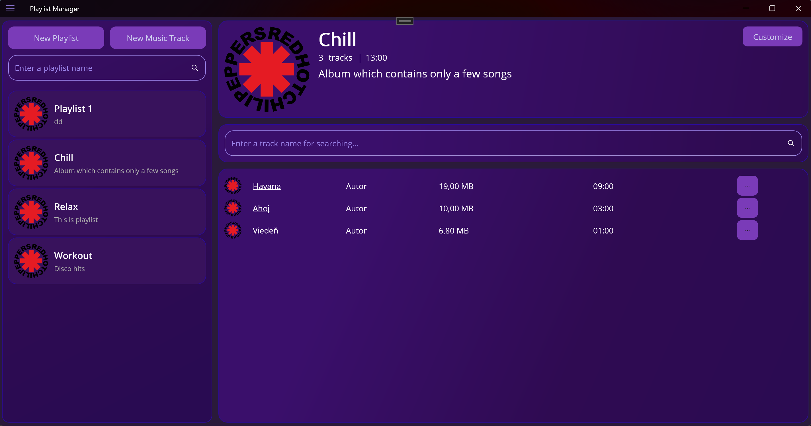
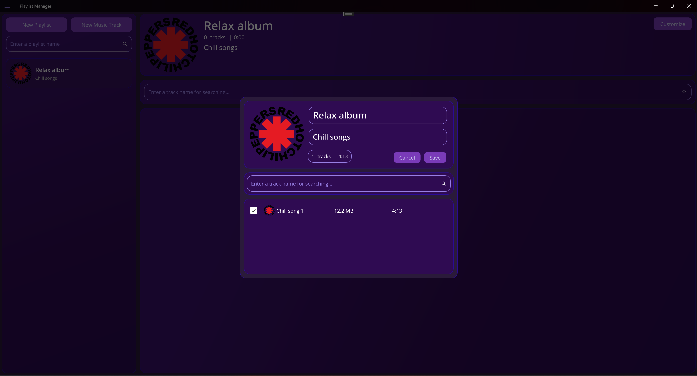
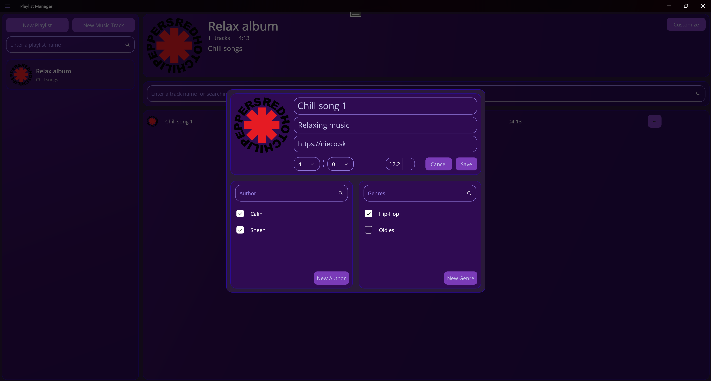
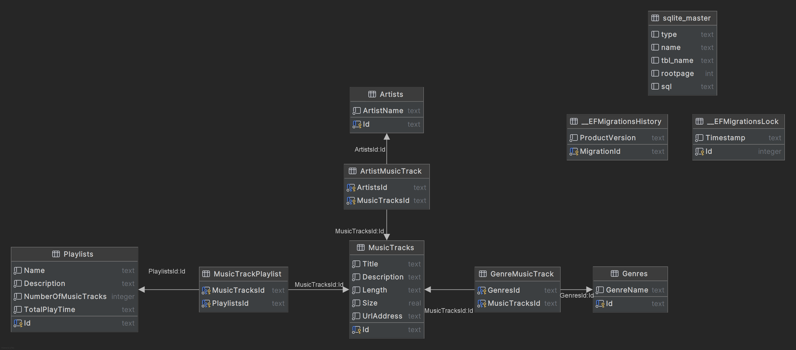
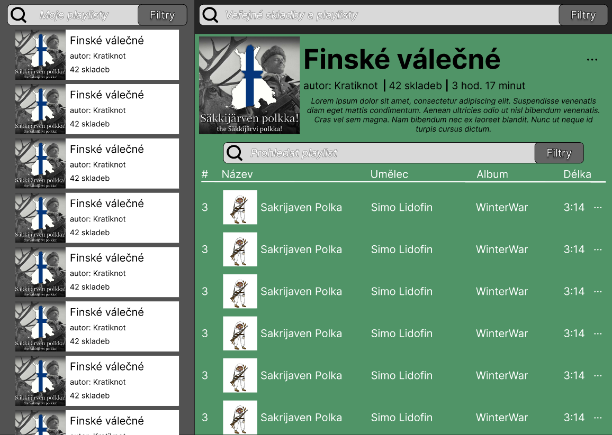

# ICS Project

## Table of Contents
*   [Application Overview](#application-overview)
*   [Team work](#team-work)
*   [Assigment](#assigment)
    *   [Goal](#goal)
    *   [Project Theme](#project-theme)
*   [Visualisation](#visualisation)
*   [Additional images](#additional-images)
    *   [ER diagram](#er-diagram)
    *   [Wireframe (Figma)](#wireframe-figma)

## Application Overview

The database application developed in this project is designed for creating and managing playlists and music tracks. The design and functionality were inspired by the streaming platform Spotify.

The Graphical User Interface (GUI) is composed of two main screens: **Playlists** and **Music Tracks**. Each of these screens is divided into two primary sections:

*   The **Left Pane** consistently displays a list of playlists.
*   The **Right Pane** presents the details relevant to the active screen and selection. Specifically:
    *   On the **Playlists** screen, it shows the details of the selected playlist.
    *   On the **Music Tracks** screen, it displays a comprehensive list of all stored music tracks.

The interface also includes modal windows (pop-ups) for creating new playlists and music tracks.

The core database entities are: **Playlist**, **Artist**, **MusicTrack**, and **Genre**. Their key properties and relationships are as follows:

*   A **Playlist** stores its name, description, the number of tracks it contains, its total playback duration, and the list of associated MusicTracks.
*   An **Artist** stores their name and a list of the MusicTracks they have created.
*   A **MusicTrack** stores its title, description, duration, file size, URL, and lists the Playlists, Artists, and Genres it is associated with.

## Team work

  
<b>Andrej Bočkaj</b>

  *   Project setup in Azure DevOps (Microsoft)
  *   Designed ER diagram
  *   Reviewed completed work & Code review 
  *   Developed Business Logic (BL) layer, including: 
      - facades
      - mappers
      - models
  *   Established connection between App and BL layers
  *   Implemented basic tests for the BL layer
  *   Defined basic structure for Views and ViewModels

  
<b>Tomáš Siakeľ</b>

  *   Designed ER diagram
  *   Implemented Data Access Layer (DAL)
  *   Implemented playlist view
  *   Implemented playlist deletion function
  *   Connected PlaylistListView ↔ PlaylistDetailView

  
<b>Vít Kološ </b>

  *   Figma wireframe/design
  *   Finalized mappers (linking, lazy registration, mapper interfaces)
  *   Implemented facade tests
  *   Tests for Genre, MusicTrack, and approximately 50% of playlist facade
  *   Transitioned to service provider
  *   GUI Development
      *   Adding/editing music tracks
      *   Adding authors and genres

  
<b>Matyáš Bubrinka</b>

  *   Figma design
  *   Created Repository, mappers, and UoW (Unit of Work)
  *   Playlist creation and editing (MAUI)

  
<b>Jakub Fiľo</b>

  *   GUI Development
      *   Adding/editing music tracks
      *   Adding authors and genres

## Assigment 
### Goal
The goal is to create a usable and easily extensible application that meets the requirements of the assignment. The application must not crash or freeze. If the user provides incorrect input, they are notified by a validation message.

The assignment leaves room for individual implementation. During evaluation, emphasis is placed on technical implementation and code quality; however, user-friendliness and graphical processing are also evaluated.

If you find that some functionality is missing from the assignment, do not hesitate to add it and document it in README.md.

### Project Theme
The theme of this year's project is the creation of a "Multimedia Playlist Manager".

You are developing an application capable of storing information about multimedia files (music, video, audiobook). You have the flexibility to support only one type of file or all of them. Users will be able to view their available multimedia and create playlists.

## Visualisation

<table>
  <tr>
    <td>
      
    </td>
    <td>
      
    </td>
  </tr>
</table>

## Additional images
### ER diagram

### Wireframe (Figma)

> Other pictures you can find [here](docs)